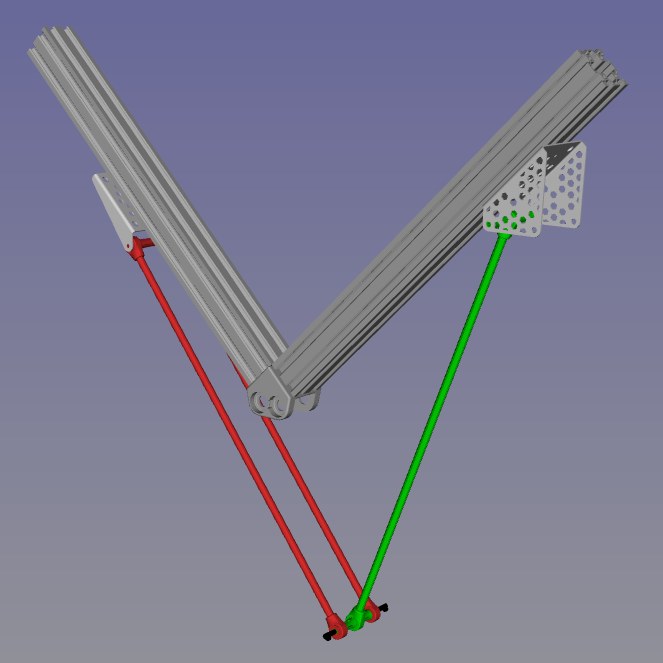

# 2Delta robot

## setting up the environment
### installing the pinocchio library
Follow the tutorial at the link [here](https://stack-of-tasks.github.io/pinocchio/download.html)
### installing gepetto viewer
If you are using Ubuntu 20.04 run:
~~~
sudo apt install robotpkg-py38-pinocchio robotpkg-py38-example-robot-data robotpkg-urdfdom robotpkg-py38-qt5-gepetto-viewer-corba robotpkg-py38-quadprog robotpkg-py38-tsid
~~~

If you are using Ubuntu 22.04 run:
~~~
sudo apt install robotpkg-py310-pinocchio robotpkg-py310-example-robot-data robotpkg-urdfdom robotpkg-py310-qt5-gepetto-viewer-corba robotpkg-py310-quadprog robotpkg-py310-tsid
~~~

## project
### inverse geomety of a closed chain robot
Since the URDF file and the ik algorithm can only solve for open chain systems, we are going to break down the problem, solving the ik for each pair of links, and let them converge to the same desired position.

### script
#### IK_solver class
The script implements a IK_solver class (see IK.solver.py). The class has two instances, one for each link chain. The **solve_GN** method uses the Gauss-Newton method in order to calculate the inverse geometry of the robot.
+ input:   (current joint position, desired end-effector position)
+ output:(new joint position)
In addition all the configuration parameters are already built-in in the class.

### What to do next
#### path and trajectory planning
Use B-splines for the path. Implement a time scaling function. Predetermine the time taken T for the movement, using acceleration and velocity contraints. (Implement also torque constraints?)

#### collision checking
Update the URDF file and check for collisions.

#### create a data package for the microcontroller
Extract the results from the inverse geometry algorithm, that will be sent to the microcontroller. The microcontroller act as a motor controller.
##### Possible idea 
The PC sends via UART (easy implementation) or canbus (better and more stable) a data package containing the number of steps that each stepper has to accomplish and a time interval, that gives the pace for velocity and acceleration control.

### gepetto viewer

