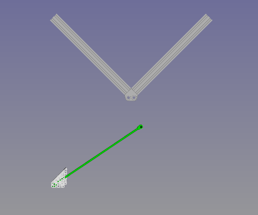

# 2Delta robot

## setting up the environment
### installing the pinocchio library
Follow the tutorial at the link [here](https://stack-of-tasks.github.io/pinocchio/download.html)
### installing gepetto viewer
If you are using Ubuntu 20.04 run:
~~~
sudo apt install robotpkg-py38-pinocchio robotpkg-py38-example-robot-data robotpkg-urdfdom robotpkg-py38-qt5-gepetto-viewer-corba robotpkg-py38-quadprog robotpkg-py38-tsid
~~~

If you are using Ubuntu 22.04 run:
~~~
sudo apt install robotpkg-py310-pinocchio robotpkg-py310-example-robot-data robotpkg-urdfdom robotpkg-py310-qt5-gepetto-viewer-corba robotpkg-py310-quadprog robotpkg-py310-tsid
~~~

## project
### inverse geomety of a closed chain robot
Since the URDF file and the ik algorithm can only solve for open chain systems, we are going to break down the problem, solving the ik for each pair of links, and let them converge to the same desired position.

### script
The script uses an IK_solver class. The class has two instances, one for each link chain. The 'solve_GN' uses the Gasuss-Newton method in order to calculate the inverse geometry of the robot.
+ input:    (current joint position, desired end-effector position)
+ output:   (new joint position)

### problems
The CHAIN_1 seems to be okay for small position displacements. However the Gauss-Newton algorithm converges, but with to many iterations (from 50 to 300 iterations).

The CHAIN_2 converges to the wrong solution.

